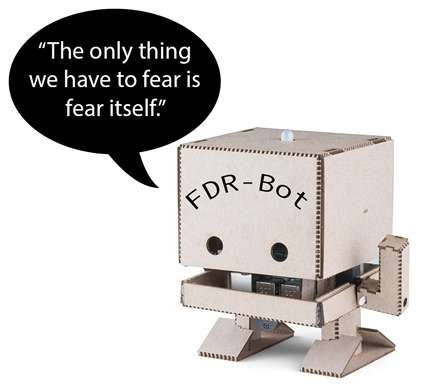

# History Bots

"History Bots" is an upper division History class offered at Centre College during CentreTerm, an intensive 16-day term offered in January between long terms. The class will be taught for the first time in January 2020.

I have taught CentreTerm classes focused on student group work, including production of video games and podcast episodes. You can learn more about me [here](https://profjohnharney.com/about-2/).

If you are a Centre student, feel free to come and see me in Crounse 424 or [email](mailto:john.harney@centre.edu) me.

**You do not need to know _anything_ about coding or computer science to take this class, do well, and have fun!**

## Course Goals
Students who take "History Bots" will:
- develop skills in historical research, gaining experience in gathering different sources and choosing which materials to use
- produce a work of history (in this case the "history bot") that engages with concepts of historical argument and narrative with a focus on a broader audience
- work in groups to plan and execute a clearly articulated project, outlining student responsibilities and milestones towards the final product.

## What will we do in this class?

### History

### Coding

